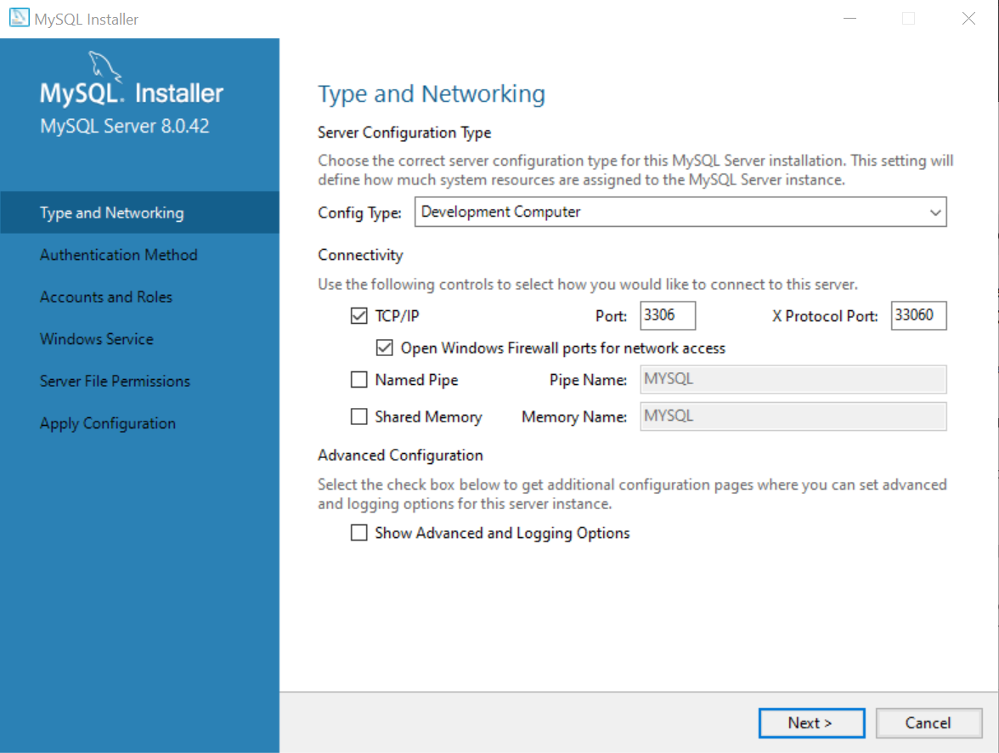
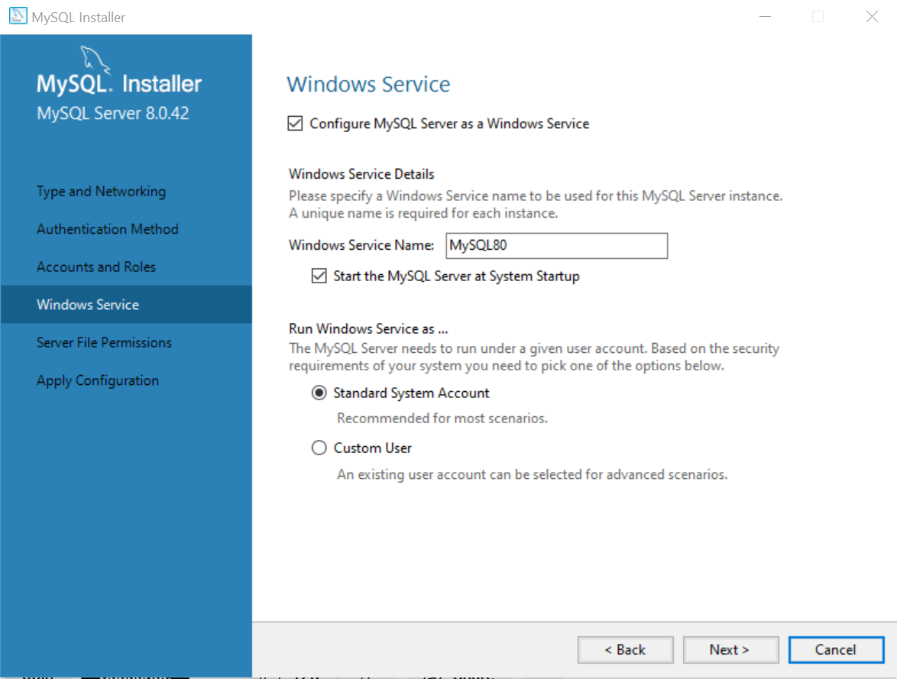

# Setup environment

**Objective:**

* To Setup **MySQL Database Management System**
* To Setup **Python Programming Langauge**
* To Connect Python with **SQLite**

**Software:**

* MySQL installer (offline version)
* Visual Studio code (VS code)

## Prerequisites: Install Microsoft Visual C++ 2019 Redistributable

 If you already have Microsoft Visual C++ 2019 Redistributable installed, you can skip this step and continue with the lab

1. Go to the official Microsoft page
[Download VC++ Redistributables](https://learn.microsoft.com/en-us/cpp/windows/latest-supported-vc-redist view=msvc-170#visual-studio-2015-2017-2019-and-2022)
2. Download the file based on your system:
    * for 64-bit [VC_redist.x64.exe](https://aka.ms/vs/17/release/vc_redist.x64.exe)
    * for 32-bit [VC_redist.x86.exe](https://aka.ms/vs/17/release/vc_redist.x86.exe)
3. Open the downloaded file and check on **I agree to the license terms and conditions**
    <figure markdown="span">
    {width="400"}
    </figure>
4.  After installation, **restart your PC**.
    <figure markdown="span">
    {width="400"}
    </figure>

## MySQL

MySQL is an open-source relational database management system (RDBMS) that uses SQL to create, manage, and query data.

### Why we will use MySQL?

1. Support **ACID transaction properites**, essential for understanding transaction management
2. Uses the **InnoDB** transactional storage engine, which supports **concurrency control** and **recovery mechanisms**
3. Flexible and easy-to-use

### Installing MySQL (Offline)

1. Go to the official [MySQL Downloads Page](https://dev.mysql.com/downloads/installer/)
2. Download the **Windows (x86, 32-bit), MSI Installer** (Offline version ~353.7M)
    <figure markdown="span">
    {width="400"}
    </figure>
3. After open the Installer Choose **Custom**
    <figure markdown="span">
    {width="400"}
    </figure>
4. Select **MySQL Servers** and **MySQL Workbench**
    <figure markdown="span">
    {width="400"}
    </figure>
5. Proceed through the installation wizard
6. Use the default port (3306)
    <figure markdown="span">
    {width="400"}
    </figure>
7. Choose the Authentication Method as below
    <figure markdown="span">
    {width="400"}
    </figure>
8. Create a root password
9. Choose Windows Service as below
    <figure markdown="span">
    {width="400"}
    </figure>
10. Proceed through the installation wizard untill finish
